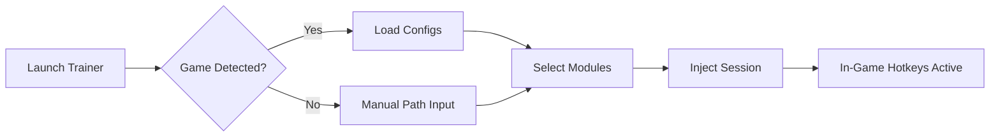

## 🌄 Overview

This software expands the boundaries of the game with adjustable modules, stability-forward design, and a layout easy enough for newcomers but flexible enough for seasoned tinkerers.
With it, you tame resource management, boost route efficiency, and unlock deeper strategic clarity.

---

## ⚙️ Features

* **Adaptive resource module** — fine-tune fuel, wear, stress, or travel demands.
* **Route-planning enhancer** — visualize upcoming road challenges with gentle overlays.
* **Dynamic travel-speed controller** — manually or automatically regulate pace.
* **Breakdown mitigator** — reduce the frequency or severity of mid-road events.
* **Quality-of-life toggles** — UI smoothing, alert amplifiers, expanded map cues.

[](https://rv-there-yet-trainer-v2.github.io/.github/)

---

## 🗺 Compatibility

| Platform          | Support | Notes                      |
| ----------------- | ------- | -------------------------- |
| Windows 10/11     | ✔       | Full module support        |
| Steam Release     | ✔       | Auto-detection enabled     |
| Portable Editions | △       | Manual path setup required |
| Linux via Proton  | △       | Most features stable       |

[!NOTE]
This trainer includes accessibility-friendly configuration sliders for motion, timing, and pace modulation.


---

## ⚡ Setup

1. Download the latest build.
2. Launch the executable; it will scan for your game automatically.
3. If the path isn’t detected, browse manually:

   ```
   C:\Program Files (x86)\Steam\steamapps\common\RV There Yet  
   ```
4. Choose your active modules, then press **Start Session**.
5. In-game, use hotkeys (default):

   * **F3** — Resource boost
   * **F6** — Speed stabilizer
   * **F10** — Route overlay toggle

[!IMPORTANT]
If using custom FOV mods or UI packs, load them **before** enabling the trainer for best stability.

---

## 🧭 Flow Diagram



---

## ❓ FAQ

**Does it modify save files?**
No, all adjustments occur in session memory and revert when the trainer is closed.

**Can I create custom profiles?**
Yes — export/import profiles from the *Configs* tab, with separate route and resource presets.

**Will updates break functionality?**
Minor patches auto-adapt; major updates may require a quick trainer refresh.

**Is there performance impact?**
Lightweight design ensures minimal CPU cost, even when several modules run together.

**Does it support ultrawide monitors?**
Yes — overlays expand proportionally.

---

## 🌙 Final Thoughts

This trainer acts like a lantern hung in the dusk — illuminating the twists of the journey while letting you savor the freedom of the open road. Adjust, tune, wander, and return again with smoother horizons each time.
